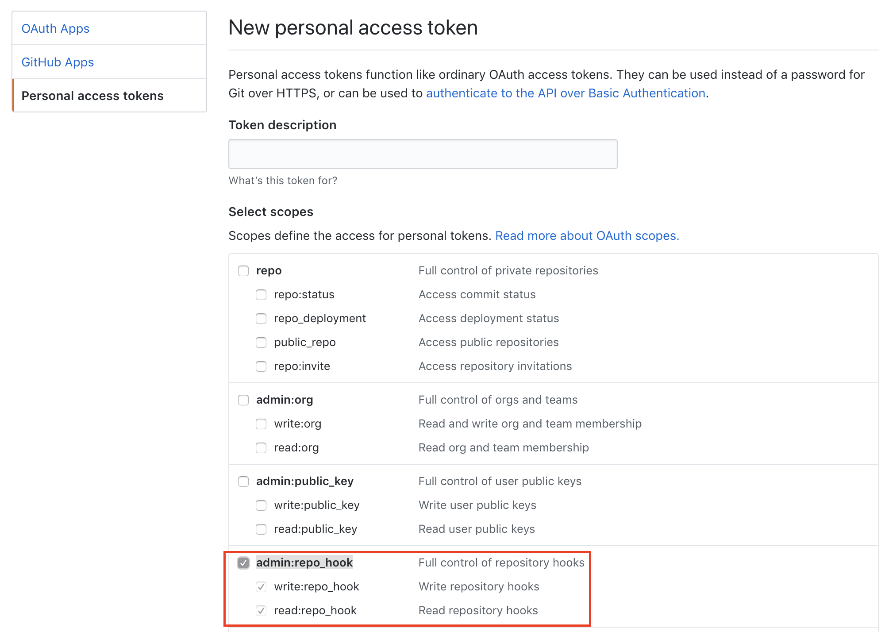

# webhookup

setup webhooks _quickly_ for your GitHub/GHE projects.

## usage

`npx webhookup [options]`.  you can also `npm install -g webhookup` or `yarn global add webhookup`

## configuration

`webhookup` can be **configured through the CLI or the environment**.  my preference is to set a few env vars and simply run `webhookup` in the current project to setup my most common webhook, then override it only as needed with the CLI.

### env

a common env config could be:

```sh
export WEBHOOK_GITHUB_TOKEN=<TOKEN>
export WEBHOOK_ENDPOINT=https://<WEBHOOK_HOST>/payload
export WEBHOOK_SECRET=<HOOK_SECRET>
export WEBHOOK_EVENTS=status,pull_request # https://developer.github.com/webhooks/#events
# export GITHUB_ENDPOINT # assume api.github.com
# export GITHUB_OWNER # let the cli discover it from your project
# export GITHUB_REPOSITORY # let the cli discover it from your project
```

then `cd /my/project && webhookup`

### cli

you can provide and/or squash any settings from the CLI:

```sh
$ webhookup --help
  github webhooks library & cli

  Usage
    $ webhookup [options]

  Options

  --github, -g or env GITHUB_ENDPOINT. defaults to github.com's api
  --owner, -o or env GITHUB_OWNER. repo owner/org. if none provided, tries to read owner from working directory
  --repository, -r or env GITHUB_REPOSITORY. repo name. if none provided, tries to read from working directory
  --token, -t or env WEBHOOK_GITHUB_TOKEN or GITHUB_TOKEN. github api token. must provide admin:repo_hook permission
  --endpoint, -h or env WEBHOOK_ENDPOINT. url to the origin (host:<port>) where your webhook listener lives
  --secret, -s or env WEBHOOK_SECRET. github webhook secret. your hook service uses this secret to verify that request is legitimate.
  --events, -e or env WEBHOOK_EVENTS. csv list of events. e.g. `status,push`
  --purge, -p delete all webhooks for repo.

  Examples
    # minimal, if you configure your env for everything
    $ webhookup

    # pragmatic option 1, specify just events, cd to your github/.git enabled project,
    # use your env for the rest
    $ webhookup -e status,push

    # pragmatic option 2, if your PWD is a github & .git enabled project
    $ webhookup -t <token> -h my.webhook.host.com -s <super-secret> -e status,push

    # ignore PWD, specify org & repo
    $ webhookup -o cdaringe -r webhookup
```

### tokens

your github token _must_ provide `admin:repo_hook` permission.  you can visit [https://github.com/settings/tokens/new](https://github.com/settings/tokens/new) to create new github API tokens.


